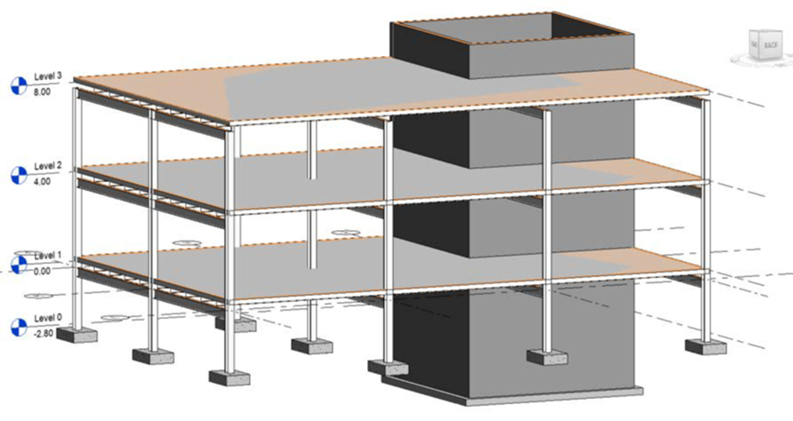
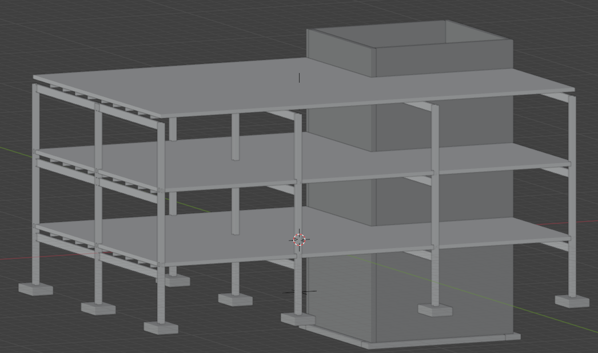
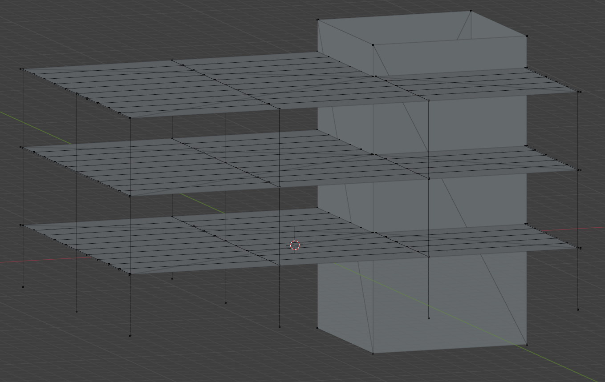

bim2fem
============

<table>
  <tr>
    <td><strong>Revit</strong></td>
    <td><strong>IFC4 (ReferenceView)</strong></td>
    <td><strong>IFC4 (StructuralAnalysisView)</strong></td>
  </tr>
  <tr>
    <td></td>
    <td></td>
    <td></td>
  </tr>
</table>

bim2fem is an open source ([LGPL]) utility for converting Building Information Models (BIM) from the 3D architectural desing models to fnite element models for structural analysis. The program uses the the opden data schema for BIM, Industry Foundation Classes ([IFC]), the open data schema for BIM, for both input and output. 

