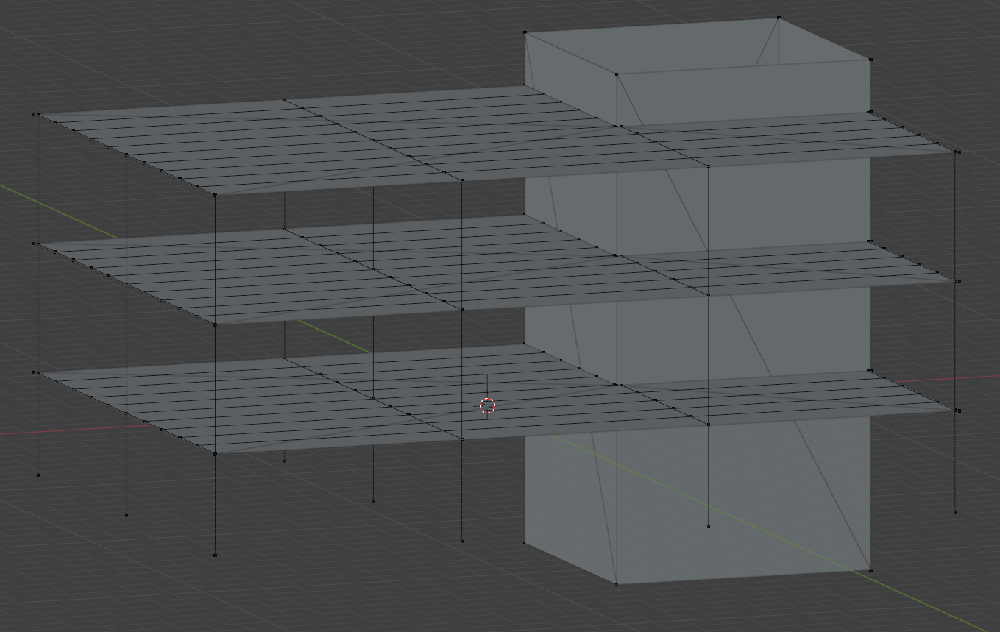

# bim2fem

<!--  -->


Convert Building Information Models (BIM) to Finite Element Models (FEM) for structural analysis.

<table>
  <tr>
    <td align="center"><strong>Revit Model</strong></td>
    <td align="center"><strong>IFC4 ReferenceView</strong></td>
    <td align="center"><strong>IFC4 StructuralAnalysisView</strong></td>
  </tr>
  <tr>
    <td></td>
    <td></td>
    <td></td>
  </tr>
</table>

## What is bim2fem?

**bim2fem** is an open-source ([LGPL]) Python-based software that converts 3D architectural [BIM] models into [FEM] models ready for structural analysis. Support for transforming 3D building and piping models is implemented for the Industry Foundation Classes ([IFC]) standard. 

### Key Features

- **BIM to FEM conversion** - Transform architectural models into structural analysis models (support for building and piping elements)
- **IFC4 support** - Compatibility with IFC standard (release [IFC4 Add2 TC1])
- **Enhanced IFC manipulation** - Extended IfcOpenShell functionality for building and piping elements via IfcPlus subpackage
- **GLB export** - Convert IFC to GLB format for 3D visualization
- **Web interface** - User-friendly GUI for non-programmers
- **Python API** - Full programmatic control for developers


### Contents

| Module | Description |
|--------|-------------|
| `bim2fem.core` | Core utility for converting IFC4 from ReferenceView/DesignTransferView to StructuralAnalysisView |
| `bim2fem.ifcplus` | Extension of the IfcOpenShell-Python library for enhanced IFC manipulation of building and piping models      |
| `bim2fem.bim2glb` | Extension of IfcConvert for improved IFC to GLB conversion for 3D visualization |


## Getting Started

### Interactive GUI (for non-developers)

If you just want to convert files using the graphical interface:

1. **Install Python** (<3.14, >=3.9) from [python.org](https://python.org)
   - ✅ During installation, check "Add Python to PATH"

2. **Download this project**
   ```bash
   git clone https://github.com/idaholab/bim2fem.git
   cd bim2fem
   ```

3. **Double-click `run_bim2fem.py`** or run:
   ```bash
   python run_bim2fem.py
   ```
   Note: Initial setup may take a couple minutes.

4. **Your browser will open** with the web interface at `http://localhost:5000`

### For Developers (API)

#### Installation from PyPI (Coming Soon)

```bash
pip install bim2fem
```

#### Installation from Source

```bash
# Clone the repository
git clone https://github.com/idaholab/bim2fem.git
cd bim2fem

# Create virtual environment (recommended)
python -m venv venv
source venv/bin/activate  # On Windows: venv\Scripts\activate

# Install dependencies
pip install -r requirements-dev.txt  # For development tools and base requirements
```

#### Basic Usage (coming soon)

```python
import ifcopenshell
from bim2fem.core import convert_ifc_to_fem
from bim2fem.bim2glb import convert_ifc_to_glb

# Additional Details Coming Soon!
```

## Development

### Development Setup

```bash
# Install development dependencies
pip install -r requirements-dev.txt
```

### Running Tests

```bash
# Run all tests
pytest tests/

# Run specific test file
pytest tests/ifcplus/api/test_geometry.py
```

### Contributing

1. Fork the repository
2. Create a feature branch (`git checkout -b feature/amazing-feature`)
3. Make your changes and add tests
4. Run tests to ensure everything works
5. Commit your changes (`git commit -m 'Add amazing feature'`)
6. Push to the branch (`git push origin feature/amazing-feature`)
7. Open a Pull Request


## Requirements

- Python <3.14, >=3.9
- IfcOpenShell
- NumPy
- Flask (for web interface)
- See `requirements.txt` for full list

## Platform Support

- ✅ Windows
- ✅ Linux
- ✅ macOS

Note: The project includes platform-specific IfcConvert executables for each OS.

## License

This project is licensed under the LGPL License - see the [LICENSE](LICENSE) file for details.

## Acknowledgments

- Developed at [Idaho National Lab]
- Built on top of [IfcOpenShell]
- IFC standard by [buildingSMART]

## Roadmap

- [ ] PyPI package publication
- [ ] Detailed Documentation
- [ ] Extension of capabilities for complex building and piping elements
- [ ] Support for IFC4x3 input files

## Support

- 📖 [Documentation](https://github.com/Crowder44/bim2fem/wiki) (Coming Soon)
- 🐛 [Report Issues](https://github.com/Crowder44/bim2fem/issues)
- 💬 [Discussions](https://github.com/Crowder44/bim2fem/discussions)

---

**Note**: This project is under active development. APIs may change in future versions.

[BIM]: https://en.wikipedia.org/wiki/Building_information_modeling "BIM"
[FEM]: https://en.wikipedia.org/wiki/Finite_element_method "FEM"
[LGPL]: https://github.com/IfcOpenShell/IfcOpenShell/tree/master/COPYING.LESSER "LGPL-3.0-or-later"
[IFC]: https://technical.buildingsmart.org/standards/ifc/ "IFC"
[IFC4 Add2 TC1]: https://standards.buildingsmart.org/IFC/RELEASE/IFC4/ADD2_TC1/HTML/ "IFC4 Add2 TC1"
[IfcOpenShell]: http://ifcopenshell.org/ "IfcOpenShell"
[buildingSMART]: https://www.buildingsmart.org/ "buildingSMART"
[Idaho National Lab]: https://inl.gov/ "Idaho National Lab"